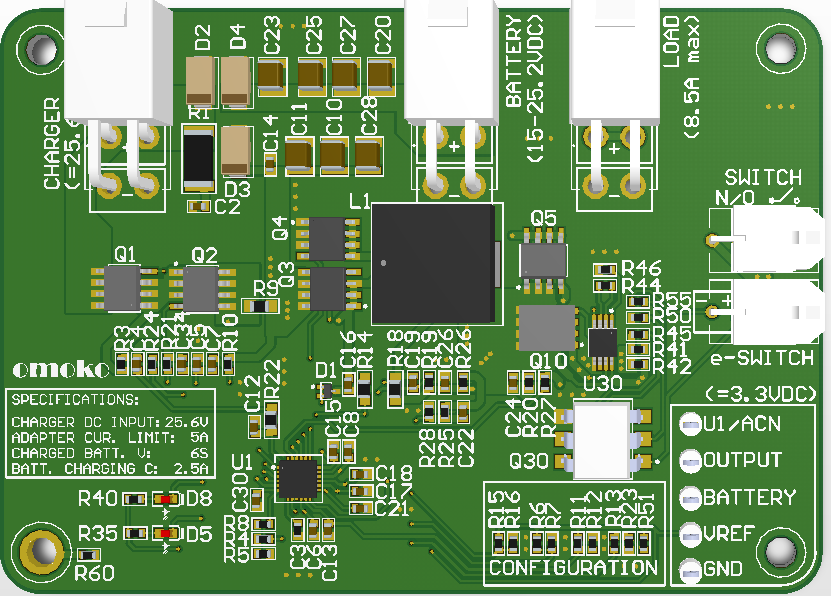
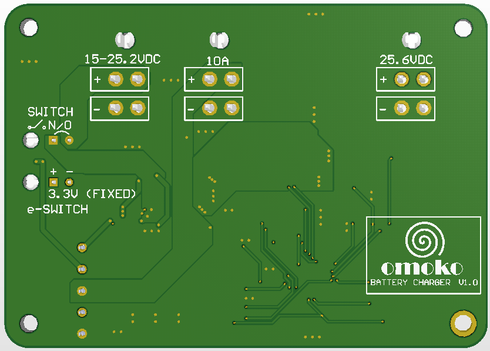

# omoko Power Supply Board

## About the PCB
A fun PCB board to implement lithium ion battery charging. The board uses TI's BQ24610 chip and is a 4-layer board.

## Requirements
1. Input: 25.6 VDC charger.
2. Output: Load 10A max, and 6S lithium ion battery.
3. e-STOP: Disconnect load using external GPIO (3V).

## Current revision
Version 1.0

